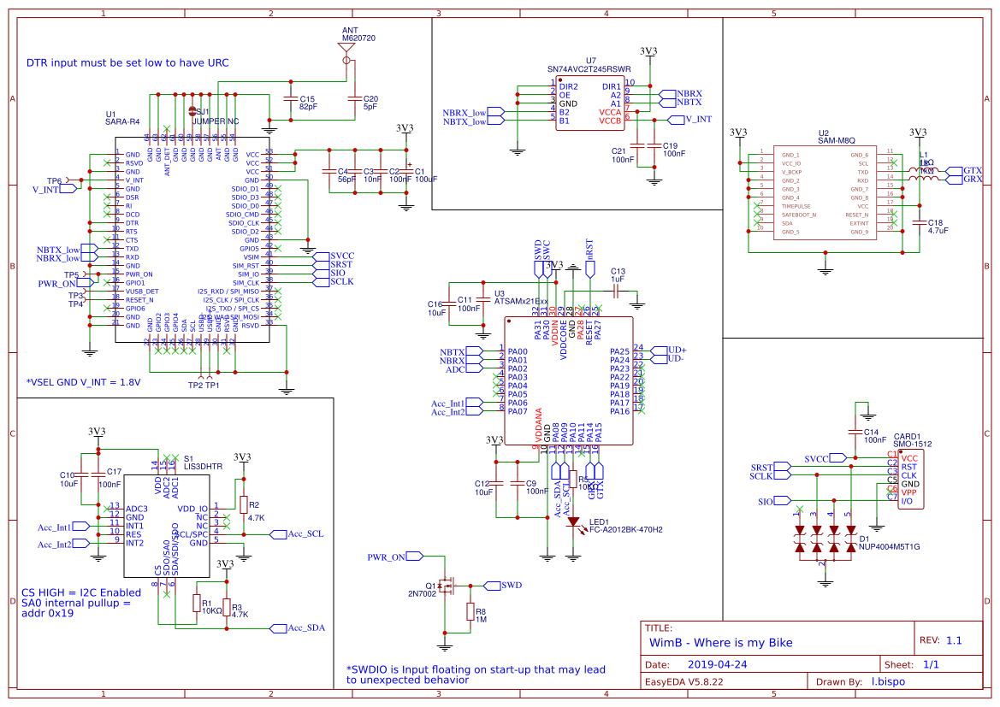
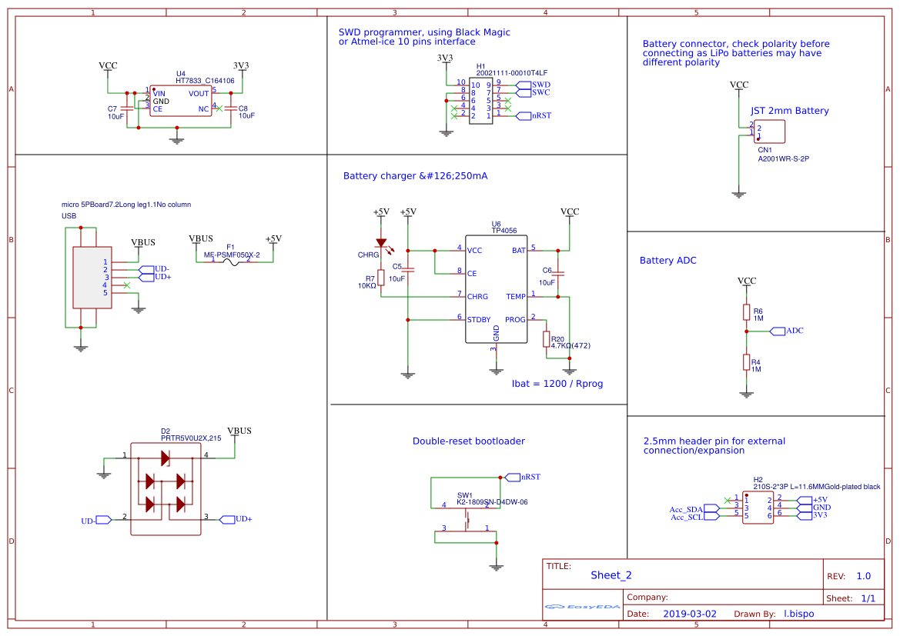

# WimB - Where is my Bike

This is a minimalist Blynk App you will 1,800 energy points.

The firmware has been writen using PlatformIO which is a nice, neat IDE, check it out:&nbsp;<a href="https://platformio.org/platformio-ide" rel="nofollow">Learn how to install PlatformIO IDE</a>

## Download Blynk App: [Getting Started with Blynk](https://www.blynk.cc/getting-started/)

* Download Blynk App:  
* Touch the QR-code icon and point the camera to the code below

* Enjoy my app!

## Schematic

## Datasheets

You can find technical information here: [datasheets](./datasheet)

## How to start?

Github Shields and Badges created with [Shields.io](https://github.com/badges/shields/)

Icons made by [Smashicons](https://www.flaticon.com/authors/smashicons) from [Flaticon](www.flaticon.com) is licensed by Creative Commons BY 3.0 [CC BY 3.0](https://creativecommons.org/licenses/by/3.0/)
