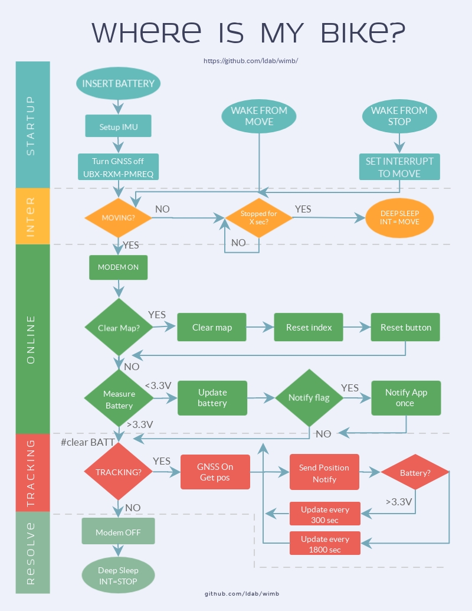
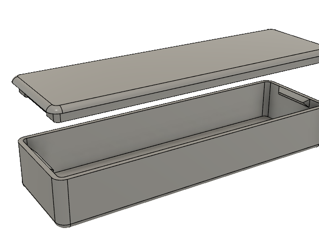

# WimB - Where is my Bike

This is a minimalist Blynk App you will 1,800 energy points.

<p>The firmware has been writen using PlatformIO which is a nice, neat IDE, check it out:&nbsp;<a href="https://platformio.org/platformio-ide" rel="nofollow">Learn how to install PlatformIO IDE</a></p>

[](https://github.com/ldab/wimb/releases/latest)
[](https://travis-ci.org/ldab/WimB)

[](https://github.com/ldab/wimb/blob/master/LICENSE)


## Download Blynk App: [Getting Started with Blynk](https://www.blynk.cc/getting-started/)

* Download Blynk App: [](http://j.mp/blynk_Android) [](http://j.mp/blynk_iOS)
* Touch the QR-code icon and point the camera to the code below
<p></p>

<p>
&nbsp;&nbsp;
</p>

* Enjoy my app!

## Content

1. [TODO](/README.md#TODO)
2. [How does it work?](/README.md#how-does-it-work)
3. [Estimated Power Consumption](/README.md#Estimated-Power-Consumption)
4. [Cellular data usage](/README.md#cellular-data-usage)
5. [SARA-R4 PWR_ON Pin](/README.md#SARA-R4-PWR_ON-Pin)
6. [SARA-R4 PSM - Power Save Mode configuration](/README.md#sara-r4-psm---power-save-mode-configuration)
7. [Schematic](/README.md#schematic)
8. [DataSheets](/README.md#datasheets)
9. [Enclosure](/README.md#enclosure)
9. [How to Start?](/README.md#how-to-start)
10. [Credits](/README.md#credits)

## TODO

- [x] Put device to sleep;
- [ ] Communnicate with SARA-R4
- [x] Set SARA-PSM values
- [ ] Communicate with GNSS;
- [ ] AssistNow AID for GNSS
- [x] Set interrupts on accelerometer;
- [x] Finish accelerometer lib
- [ ] Monitor SARA GPIO in order to detect modem is ready +UGPIOC
- [ ] Monitor SARA V_INT in order to detect modem ON
- [ ] Monitor GNSS *something* in order to detect GNSS awake

## How does it work?

Here you will find a simplified flowchart demonstrating how the code works: 



## Estimated Power Consumption

This is hard to predict however we have the [Datasheets](./datasheet) and can roughly estimate it, we have:
* ATSAMD21E18 MCU;
* SARA-R412;
* SAM-M8Q;
* LIS3DH IMU;
* TXS0102 Level-shifter;
* SN74LVC1G07 Level-shifter;
* HT7833 LDO;
* TP4056 Battery charger;
* Battery ADC;

#### Low power - Sleeping

Component                 | ~TYP μA
------------------------- | ------
ATSAMD21E18 MCU           | 4
SARA-R412                 | 6
SAM-M8Q                   | 15
LIS3DH IMU                | 2
TXS0102 Level-shifter     | 2
SN74LVC1G07 Level-shifter | 5
HT7833 LDO                | Assume 10
TP4056 Battery charger    | 2
Battery ADC               | 2
TOTAL                     | 48

#### Tracking

Component                 | ~TYP μA
------------------------- | ------
ATSAMD21E18 MCU           | 4,000
SARA-R412                 | 27,200*
SAM-M8Q                   | 9,500
LIS3DH IMU                | 2
TXS0102 Level-shifter     | 14
SN74LVC1G07 Level-shifter | 5
HT7833 LDO                | Assume 10
TP4056 Battery charger    | 2
Battery ADC               | 2
TOTAL                     | ~41mA

*Current for Modem depends on the update interval, registration and signal level -> 200mA max for TX/RX @30sec to exec every 300 sec + 9mA @Active mode = 27.2mA 

## Cellular data usage

[Blynk Protocol message](https://github.com/blynkkk/blynk-server/blob/master/docs/README_FOR_APP_DEVS.md#protocol-messages)

* [Blynk HEARTBEAT](https://community.blynk.cc/t/expected-data-usage-for-hardware-connection-heartbeat-to-blynk-server/7138/16) = 5 bytes every minute;
* [Button message](https://community.blynk.cc/t/solved-gsm-data-usage/16122/2?u=ldb) = ~10 bytes
* [Data message](https://community.blynk.cc/t/blynk-electron-data-usage-extremely-high/16577/4?u=ldb) = ~14 bytes
* [TCP Overhead?](https://community.blynk.cc/t/expected-data-usage-for-hardware-connection-heartbeat-to-blynk-server/7138/16) = 20 bytes

If it connects twice a day non-active => ( Clear Map + Active? + Update Battery ) * 2 = bump it up to 80 bytes/day

Active mode running at 300 seconds => ( 5 * Heartbeat + Active? + Update Battery + Send location )* 12 = 800 bytes/hour

## SARA-R4 PWR_ON Pin

Low  level  on  the PWR_ON pin,  which  is  normally  set  high  by  an  internal  pull-up,  for  a  valid  time period  when  the applied VCCvoltage  is  within  the  valid  operating  range. The PWR_ON line has to be driven by open drain, open collector or contact switch

Parameter       |Min. |Max.  |Unit|Remarks
--------------- | --- |----- | -- | ---------------------------------------
PWR_ON low time |0.15 | 3.20 | s  | Low time to trigger module switch *ON*
PWR_ON low time |1.5  |      | s  | Low time to trigger module switch *OFF*

## SARA-R4 PSM - Power Save Mode configuration

The grant of PSM is a negotiation between SARA-R4/N4 series module and the **attached network:** the network accepts PSM  by  providing  the  actual  value  of  the  “Active  Timer”  (and  “Periodic  Update Timer”) to be used in the Attach/TAU/RAU accept procedure. The maximum duration, including the “Periodic Update Timer”, is about 413 days.  The SARA-R4/N4  series module  enters  PSM  low  power deep sleep mode only after the “Active Timer” expires

* If  the  power  saving  mode  is  enabled  (+CPSMS:  1),  everything  on  the  device  will  power  down  except  thereal-time clock (RTC) after the expiry of T3324 (Active Time). It will stay powered down until the expiry ofT3412 (Extended TAU Timer) or if the Power On line is toggled.
* If the power saving mode is disabled (+CPSMS: 0), the device will not enter Power Save Mode (PSM)

#### Requested_Periodic_TAU - PSM total duration

```
Bits 5 to 1 represent the binary coded timer value.
Bits 6 to 8 defines the timer value unit for the GPRS timer:
8 7 6 
0 0 0 value is incremented in multiples of 10 minutes
0 0 1 value is incremented in multiples of 1 hour
0 1 0 value is incremented in multiples of 10 hours
0 1 1 value is incremented in multiples of 2 seconds
1 0 0 value is incremented in multiples of 30 seconds
1 0 1 value is incremented in multiples of 1 minute
1 1 0 value is incremented in multiples of 320 hours
1 1 1 value indicates that the timer is deactivated.
```

**The requested extended periodic TAU value(T3412) iscoded as one byte (octet 3) of the GPRS Timer 3 information element coded as bitformat (e.g. "10100001" equals 1 minute).  see the GPRS Timer 3 IE in 3GPP TS 24.008 Table10.5.163a/3GPP TS 24.008 - page 669**

#### Requested_Active_Time - Active/Paging time

```
Bits 5 to 1 represent the binary coded timer value.
Bits 6 to 8 defines the timer value unit for the GPRS timer as follows:
Bits
8 7 6
0 0 0  value is incremented in multiples of 2 seconds
0 0 1  value is incremented in multiples of 1 minute
0 1 0  value is incremented in multiples of decihours
1 1 1  value indicates that the timer is deactivated.

Other values shall be interpreted as multiples of 1 minute in this version of the protocol. 
```

**Requested Active Time value (T3324) iscoded as one byte (octet 3) of the GPRS Timer 2 information element coded as bitformat (e.g. "00100100" equals 4 minutes).  see the GPRS Timer 2 IE in 3GPP TS 24.008 Table10.5.163/3GPP TS 24.008 - page 668**

## Schematic


## Datasheets

You can find technical information here: [datasheets](./datasheet)

## Enclosure

A 3D print file for the enclosure is also available (untestest/not printed) [here](./3DPrint Enclosure).



## How to start?


## Credits

Github Shields and Badges created with [Shields.io](https://github.com/badges/shields/)

Flowchart made with [VISME](https://www.visme.co/)

3D Design inspired by [Adafruit Youtube video](https://www.youtube.com/watch?v=VVmOtM60VWw) using [Autodesk Fusin 360](https://www.autodesk.com/products/fusion-360/overview)

Icons made by [Smashicons](https://www.flaticon.com/authors/smashicons) from [Flaticon](www.flaticon.com) is licensed by Creative Commons BY 3.0 [CC BY 3.0](https://creativecommons.org/licenses/by/3.0/)
